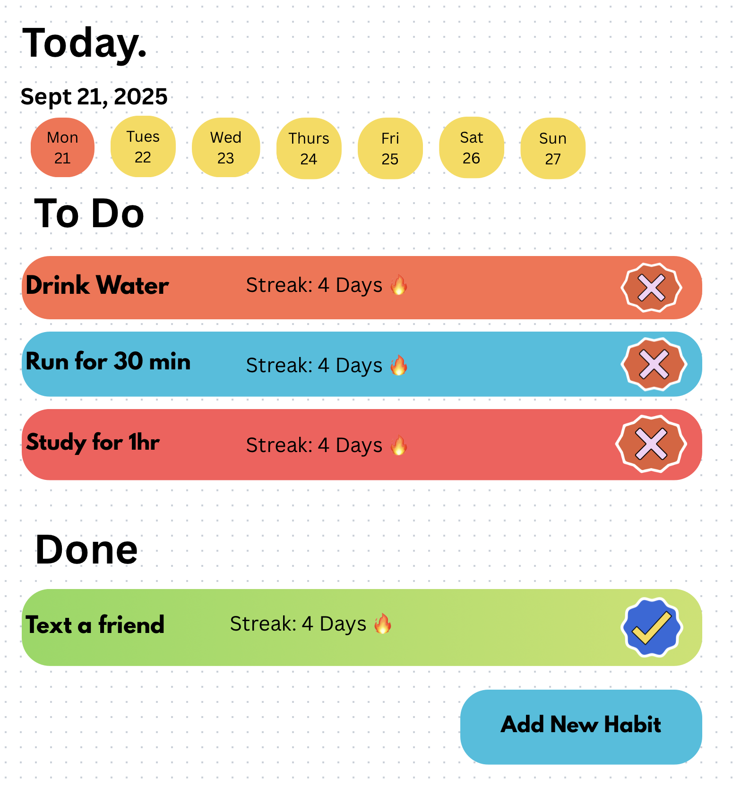
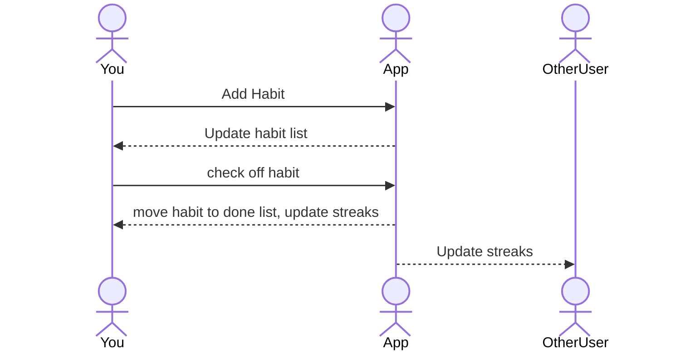

# MyHabits

[My Notes](notes.md)

MyHabits is an app that most efficiently and easily tracks your daily habits. This list of daily habits can be as long or short as you want. You may also be able to see your streak for each habit to see how well you are doing. This app also allows you to go back and check previous days to check which habits you accomplished on that specific day.

> [!NOTE]
> This is a note I want to keep here to add notes in the future.

## 🚀 Specification Deliverable

> [!NOTE]
> Fill in this sections as the submission artifact for this deliverable. You can refer to this [example](https://github.com/webprogramming260/startup-example/blob/main/README.md) for inspiration.

For this deliverable I did the following. I checked the box `[x]` and added a description for things I completed.

- [x] Proper use of Markdown
- [x] A concise and compelling elevator pitch
- [x] Description of key features
- [x] Description of how you will use each technology
- [x] One or more rough sketches of your application. Images must be embedded in this file using Markdown image references.

### Elevator pitch

Do you ever struggle to keep up with your daily habits or forget the progress you’ve made? Our habit tracker app makes it simple to stay consistent, track your streaks, and build the routines that matter most. Stay motivated, stay accountable, and watch your habits turn into lasting change.

### Design

Here is a sequence Diagram showing how users interact with the application to complete tasks and see their streaks or their habits on certain days.

### Key features

- Secure login over HTTPS
- Streak displayed and saved for each time you use
- Total streak displayed in realtime for your friends to see
- Display of board and numbers
- Ability to connect with friends and keep each other accountable
- Display of tiles changing positions and updating.

### Technologies

I am going to use the required technologies in the following ways.

- **HTML** - Structure the basic layout of the webpage and including the main dashboard, buttons, and streak displays
- **CSS** - Application styling such as colors and shape of number tiles, board layout, animations for tile movement, and other styling for compatability with different devices.
- **React** - Interactive user interface. Handle the tile state, update streaks, and add new tiles.
- **Service** - Implement tracker core logic such as adding and updating tiles, checking dashboard conditions, calculating streaks.
- **DB/Login** - Save data of user logins, streaks, and track days habits were completed in database.
- **WebSocket** - Streaks are saved for friends to see.

## 🚀 AWS deliverable

For this deliverable I did the following. I checked the box `[x]` and added a description for things I completed.

- [x] **Server deployed and accessible with custom domain name** - [My server link](https://startup.myhabits.click).

## 🚀 HTML deliverable

For this deliverable I did the following. I checked the box `[x]` and added a description for things I completed.

- [x] **HTML pages** - I did complete this part of the deliverable.
- [x] **Proper HTML element usage** - I did complete this part of the deliverable.
- [x] **Links** - I did complete this part of the deliverable.
- [x] **Text** - I did complete this part of the deliverable.
- [x] **3rd party API placeholder** - place for Autogenerated Anime quotes on my about page
- [x] **Images** - I linked an image from my images folder
- [x] **Login placeholder** - I Included a place to put a username and password, and a login or create pofile buttons
- [x] **DB data placeholder** - I included a placeholder for a streaks table that will show the top 5 people with the biggest streaks
- [x] **WebSocket placeholder** - I included a place on the habits page that will show the realtime updates of streaks if someone got a streak of 10,20,30,etc.

## 🚀 CSS deliverable

For this deliverable I did the following. I checked the box `[x]` and added a description for things I completed.

- [x] **Header, footer, and main content body** - I styled all of these components to look nice and natural with the pages.
- [x] **Navigation elements** - I put these in the header and styled them nicely
- [x] **Responsive to window resizing** - I rendered the pages to be responsive with the size of the window
- [x] **Application elements** - I styled all the elements of the pages to match and look nice.
- [x] **Application text content** - I styled all the text and orgainzed it to go where I want
- [x] **Application images** - I rounded the image in the app to look nice and fit in the center of the page

## 🚀 React part 1: Routing deliverable

For this deliverable I did the following. I checked the box `[x]` and added a description for things I completed.

- [x] **Bundled using Vite** - installed and configured vite to bundle for production and debugging.
- [x] **Components** - created and converted all the html for each page to react components.
- [x] **Router** - I implemented routes to each of the apps pages

## 🚀 React part 2: Reactivity deliverable

For this deliverable I did the following. I checked the box `[x]` and added a description for things I completed.

- [X] **All functionality implemented or mocked out** - I implemented authenitcation for my login page, functionailty to create and completed tasks on my habit page(I'm not implementing the calendar anymore because it is too complicated for me right now). I change functionality for my api quote generater on my about page, and scores page to update, when a habit is complete it counts how many are completed that day..
- [x] **Hooks** - I implemented the use.State to store the data with a state hook setHabit, and use.Effect hook to load habits into local storage to put them into my scores table. I also use it to store and load the data from the habits page

## 🚀 Service deliverable

For this deliverable I did the following. I checked the box `[x]` and added a description for things I completed.

- [x] **Node.js/Express HTTP service** - I set up a Node.js Express server that handles user authentication and task tracking, including routes for login, registration, and scores.
- [x] **Static middleware for frontend** - I configured Express to serve my React frontend, allowing the app to load directly from the same server instead of relying only on the Vite dev server.
- [x] **Calls to third party endpoints** - I integrated a third-party API (AnimeChan) to fetch and display random anime quotes and images in my app.
- [x] **Backend service endpoints** - I implemented API endpoints for user authentication, task completion tracking, and retrieving score data from memory
- [x] **Frontend calls service endpoints** - My React frontend makes fetch calls to the backend endpoints for login, registration, logging completions, and displaying
- [x] **Supports registration, login, logout, and restricted endpoint** - Allows users to register, log in with encrypted passwords, stay authenticated via cookies, log out, and access restricted data like scores only when logged in.

## 🚀 DB deliverable

For this deliverable I did the following. I checked the box `[x]` and added a description for things I completed.

- [x] **Stores data in MongoDB** - I set up my app so it stores the tasks that are added, completed, and streak in mongoDB.
- [x] **Stores credentials in MongoDB** - My app stores the users and their information for login and authentication.

## 🚀 WebSocket deliverable

For this deliverable I did the following. I checked the box `[x]` and added a description for things I completed.

- [x] **Backend listens for WebSocket connection** - The server is set up with peerProxy ans successfully accepts WebSocket connections from clients
- [x] **Frontend makes WebSocket connection** - The client now successfullt connect to the Websocket server and can recieve events
- [x] **Data sent over WebSocket connection** - Habit complettions and streak milestones are sent from the client to all other connected clients via broadcasts.
- [x] **WebSocket data displayed** - The frontend component receives events from habitnotifier and displays them in the UI in real time.
- [x] **Application is fully functional** - The Websocket feater is integrated end-to-end: server send updates, clients receive them, and the UI displays them.
