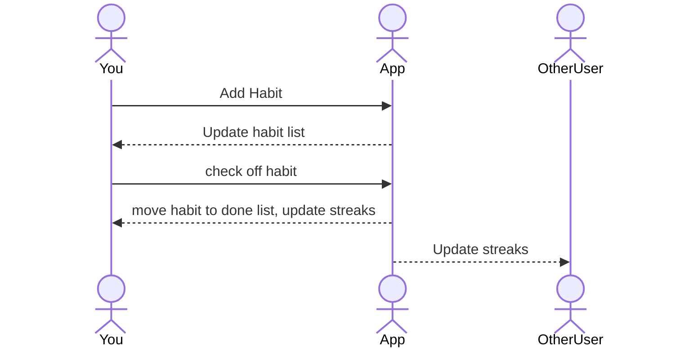

# MyHabits

[My Notes](notes.md)

MyHabits is an app that most efficiently and easily tracks your daily habits. This list of daily habits can be as long or short as you want. You may also be able to see your streak for each habit to see how well you are doing. This app also allows you to go back and check previous days to check which habits you accomplished on that specific day.

> [!NOTE]
> This is a note I want to keep here to add notes in the future.

## 🚀 Specification Deliverable

> [!NOTE]
> Fill in this sections as the submission artifact for this deliverable. You can refer to this [example](https://github.com/webprogramming260/startup-example/blob/main/README.md) for inspiration.

For this deliverable I did the following. I checked the box `[x]` and added a description for things I completed.

- [x] Proper use of Markdown
- [x] A concise and compelling elevator pitch
- [x] Description of key features
- [x] Description of how you will use each technology
- [x] One or more rough sketches of your application. Images must be embedded in this file using Markdown image references.

### Elevator pitch

Do you ever struggle to keep up with your daily habits or forget the progress you’ve made? Our habit tracker app makes it simple to stay consistent, track your streaks, and build the routines that matter most. Stay motivated, stay accountable, and watch your habits turn into lasting change.

### Design

Here is a sequence Diagram showing how users interact with the application to complete tasks and see their streaks or their habits on certain days.

### Key features

- Secure login over HTTPS
- Streak displayed and saved for each time you use
- Total streak displayed in realtime for your friends to see
- Display of board and numbers
- Ability to connect with friends and keep each other accountable
- Display of tiles changing positions and updating.

### Technologies

I am going to use the required technologies in the following ways.

- **HTML** - Structure the basic layout of the webpage and including the main dashboard, buttons, and streak displays
- **CSS** - Application styling such as colors and shape of number tiles, board layout, animations for tile movement, and other styling for compatability with different devices.
- **React** - Interactive user interface. Handle the tile state, update streaks, and add new tiles.
- **Service** - Implement tracker core logic such as adding and updating tiles, checking dashboard conditions, calculating streaks.
- **DB/Login** - Save data of user logins, streaks, and track days habits were completed in database.
- **WebSocket** - Streaks are saved for friends to see.

## 🚀 AWS deliverable

For this deliverable I did the following. I checked the box `[x]` and added a description for things I completed.

- [x] **Server deployed and accessible with custom domain name** - [My server link](https://startup.myhabits.click).

## 🚀 HTML deliverable

For this deliverable I did the following. I checked the box `[x]` and added a description for things I completed.

- [x] **HTML pages** - I did complete this part of the deliverable.
- [x] **Proper HTML element usage** - I did complete this part of the deliverable.
- [x] **Links** - I did complete this part of the deliverable.
- [x] **Text** - I did complete this part of the deliverable.
- [x] **3rd party API placeholder** - place for Autogenerated Anime quotes on my about page
- [x] **Images** - I linked an image from my images folder
- [x] **Login placeholder** - I Included a place to put a username and password, and a login or create pofile buttons
- [x] **DB data placeholder** - I included a placeholder for a streaks table that will show the top 5 people with the biggest streaks
- [x] **WebSocket placeholder** - I included a place on the habits page that will show the realtime updates of streaks if someone got a streak of 10,20,30,etc.

## 🚀 CSS deliverable

For this deliverable I did the following. I checked the box `[x]` and added a description for things I completed.

- [x] **Header, footer, and main content body** - I styled all of these components to look nice and natural with the pages.
- [x] **Navigation elements** - I put these in the header and styled them nicely
- [x] **Responsive to window resizing** - I rendered the pages to be responsive with the size of the window
- [x] **Application elements** - I styled all the elements of the pages to match and look nice.
- [x] **Application text content** - I styled all the text and orgainzed it to go where I want
- [x] **Application images** - I rounded the image in the app to look nice and fit in the center of the page

## 🚀 React part 1: Routing deliverable

For this deliverable I did the following. I checked the box `[x]` and added a description for things I completed.

- [x] **Bundled using Vite** - installed and configured vite to bundle for production and debugging.
- [x] **Components** - created and converted all the html for each page to react components.
- [x] **Router** - I implemented routes to each of the apps pages

## 🚀 React part 2: Reactivity deliverable

For this deliverable I did the following. I checked the box `[x]` and added a description for things I completed.

- [ ] **All functionality implemented or mocked out** - I did not complete this part of the deliverable.
- [ ] **Hooks** - I did not complete this part of the deliverable.

## 🚀 Service deliverable

For this deliverable I did the following. I checked the box `[x]` and added a description for things I completed.

- [ ] **Node.js/Express HTTP service** - I did not complete this part of the deliverable.
- [ ] **Static middleware for frontend** - I did not complete this part of the deliverable.
- [ ] **Calls to third party endpoints** - I did not complete this part of the deliverable.
- [ ] **Backend service endpoints** - I did not complete this part of the deliverable.
- [ ] **Frontend calls service endpoints** - I did not complete this part of the deliverable.
- [ ] **Supports registration, login, logout, and restricted endpoint** - I did not complete this part of the deliverable.

## 🚀 DB deliverable

For this deliverable I did the following. I checked the box `[x]` and added a description for things I completed.

- [ ] **Stores data in MongoDB** - I did not complete this part of the deliverable.
- [ ] **Stores credentials in MongoDB** - I did not complete this part of the deliverable.

## 🚀 WebSocket deliverable

For this deliverable I did the following. I checked the box `[x]` and added a description for things I completed.

- [ ] **Backend listens for WebSocket connection** - I did not complete this part of the deliverable.
- [ ] **Frontend makes WebSocket connection** - I did not complete this part of the deliverable.
- [ ] **Data sent over WebSocket connection** - I did not complete this part of the deliverable.
- [ ] **WebSocket data displayed** - I did not complete this part of the deliverable.
- [ ] **Application is fully functional** - I did not complete this part of the deliverable.

.body {
display: flex;
flex-direction: column;
min-width: 375px;
}

header {
/_ background-color: rgb(202, 220, 236); _/
/_ text-align: center; _/
}

main {
background: white;
padding: 1rem;
margin: 1rem;
border-radius: 8px;
box-shadow: 0 2px 6px rgba(0, 0, 0, 0.2);
}

footer {
flex: 0 30px;
background-color: rgb(202, 220, 236);
padding: 1em;

display: flex;
justify-content: space-between;
align-items: center;

position: fixed;
bottom: 0;
left: 0;
right: 0;
}

footer a {
text-decoration: none;
color: black;
}

footer a:hover {
color: brown;
transform: scale(1.05);
text-decoration: underline;
}
